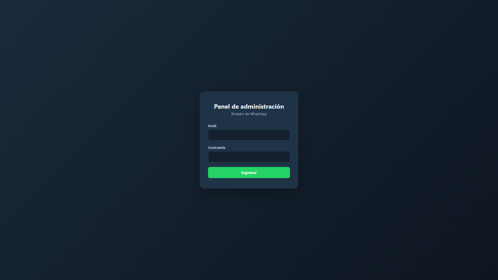
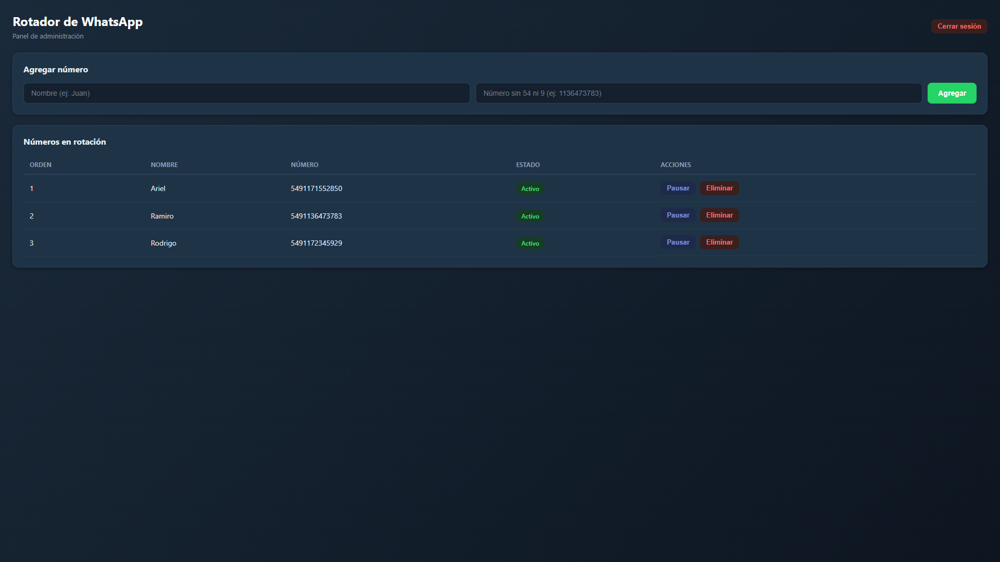
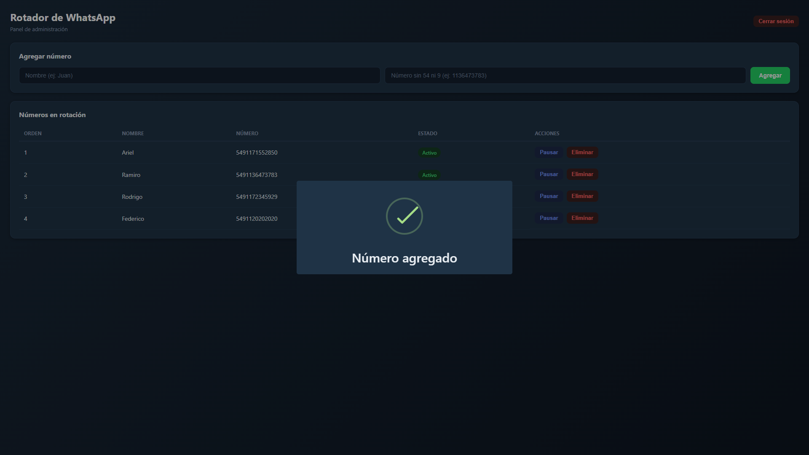
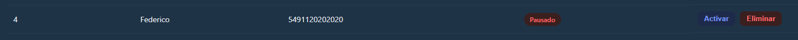
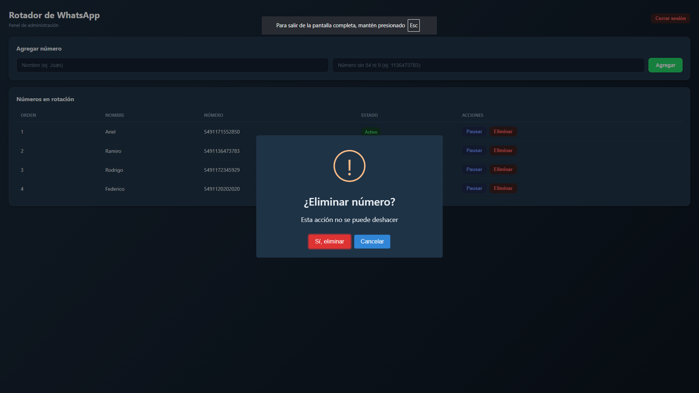

# Panel de administracion del rotador de WhatsApp

Panel privado para administrar los números de WhatsApp que utiliza el rotador. La
aplicacion esta pensada para una sola persona administradora: no tiene registro
publico ni una vista publica de los números cargados.

## Que problema resuelve

El sistema mantiene una lista ordenada de números de WhatsApp. El administrador
puede:

- agregar un nombre y un numero;
- activar o pausar un numero sin borrarlo;
- eliminar un numero;
- ver el orden actual de la rotacion;
- cerrar la sesion cuando termina de administrar.

Los números se guardan en Supabase y la funcion `supabase/functions/go` obtiene
el siguiente numero mediante la funcion SQL `get_next_whatsapp`. Luego redirige
al visitante a WhatsApp con un mensaje inicial.

## Como funciona

1. Una persona visita el panel y llega a `/login`.
2. Ingresa el email y la contrasena del usuario creado en Supabase Auth.
3. `authGuard` consulta la sesion actual antes de permitir el acceso a
	 `/dashboard`.
4. El dashboard lee los registros de `whatsapp_numbers`, ordenados por `orden`.
5. Al agregar un numero, el panel limpia los caracteres no numericos, valida que
	 tenga entre 10 y 11 digitos y antepone `549`.
6. Al pausar o activar, se actualiza el campo `activo`.
7. Al eliminar, se borra el registro y se recalcula el orden restante.
8. Al cerrar sesion, Supabase invalida la sesion y el panel vuelve a `/login`.

### Rutas

| Ruta | Funcion | Acceso |
| --- | --- | --- |
| `/login` | Inicio de sesion | Sin sesion |
| `/dashboard` | Administracion de números | Sesion valida |
| `/` | Redireccion a `/login` | Publica |
| Cualquier otra ruta | Redireccion a `/login` | Publica |

## Privacidad y seguridad

Que el panel sea privado implica dos capas distintas:

1. **Experiencia de usuario:** las guardas de Angular redirigen a `/login` a
	 quien no tiene una sesion.
2. **Seguridad real:** Supabase debe impedir desde el servidor que un usuario no
	 autorizado lea o modifique `whatsapp_numbers`.

La guarda del frontend no debe considerarse una medida de seguridad suficiente:
el JavaScript descargado por el navegador puede ser inspeccionado y las
peticiones pueden intentarse fuera de la interfaz. Por eso, antes de compartir
el enlace de produccion, hay que verificar en Supabase:

- que el registro de Auth sea solo el del administrador;
- que no exista registro publico ni una pantalla de alta;
- que RLS este habilitado en `whatsapp_numbers`;
- que las politicas permitan `select`, `insert`, `update` y `delete` solo a la
	cuenta autorizada;
- que la clave `service_role` se mantenga exclusivamente como secreto de la
	Edge Function y nunca llegue al frontend;
- que la Edge Function valide el uso que se espera de ella y no exponga datos
	innecesarios.

La clave `anon` del frontend no es un secreto. La proteccion debe estar en Auth,
RLS y las politicas de la base de datos. No se deben publicar capturas con
emails, claves, URLs privadas de despliegue ni números reales.

## Estructura del repositorio

```text
panel/
	src/app/
		guards/                 Control de acceso por sesion
		pages/login/            Formulario de inicio de sesion
		pages/dashboard/        CRUD visual de números
		services/supabase.ts    Auth y operaciones sobre la base de datos
		app.routes.ts           Rutas y guardas
	src/environments/         Configuracion del cliente Supabase
	vercel.json               Rewrite para Angular en Vercel
	package.json              Scripts y dependencias

supabase/
	functions/go/index.ts     Redireccion al siguiente WhatsApp
	config.toml               Configuracion local de Supabase
```

## Componentes y tecnologias

- Angular 21 con componentes standalone.
- TypeScript y formularios de Angular.
- Supabase Auth para email y contrasena.
- Supabase Database para `whatsapp_numbers`.
- Supabase Edge Functions con Deno.
- SweetAlert2 para confirmaciones, errores y mensajes de resultado.
- Vercel para servir el panel y resolver las rutas del frontend.

## Modelo de datos esperado

La tabla principal es `whatsapp_numbers`. El frontend utiliza estos campos:

| Campo | Uso |
| --- | --- |
| `id` | Identificador del registro |
| `numero` | Numero completo, almacenado con prefijo `549` |
| `nombre` | Nombre visible para el administrador |
| `orden` | Posicion dentro de la rotacion |
| `activo` | Indica si el numero puede ser seleccionado |

La funcion SQL `get_next_whatsapp` debe seleccionar solo números activos y
resolver el criterio de rotacion definido por la base de datos. Ese criterio es
la fuente final de verdad para la redireccion.

## Material visual recomendado

Las capturas del funcionamiento se encuentran en
`panel/docs/screenshots/`. Cada una muestra una etapa del uso del panel con
datos de ejemplo.

```text
panel/
	docs/
		screenshots/
			login.png
			dashboard.png
			agregarnumero.png
			pausarnumero.png
			eliminarnumero.png
```

### 1. Inicio de sesion



La pantalla inicial solicita el email y la contrasena del administrador. No hay
registro publico: una persona sin una sesion valida no puede entrar al panel de
administracion.

### 2. Dashboard



Luego de iniciar sesion, el dashboard muestra los numeros guardados en orden. La
tabla permite consultar el nombre, el numero, el estado actual y las acciones
disponibles para cada registro.

### 3. Agregar un numero



El administrador completa el nombre y el numero. El panel valida los datos,
limpia caracteres que no sean numericos, evita duplicados y agrega el prefijo
`549` antes de guardarlo en Supabase. El nuevo numero queda al final del orden
de rotacion.

### 4. Pausar o activar un numero



Al seleccionar **Pausar**, el numero deja de estar disponible para la rotacion,
pero permanece guardado en la tabla. El estado cambia a `Pausado` y la accion
disponible pasa a ser **Activar**, como se observa en la captura. Al activarlo,
vuelve a estar disponible para la funcion `get_next_whatsapp`.

### 5. Eliminar un numero



La accion **Eliminar** solicita confirmacion antes de borrar el registro. Una
vez confirmado, el numero se elimina de Supabase y el panel recalcula el orden
de los numeros restantes.